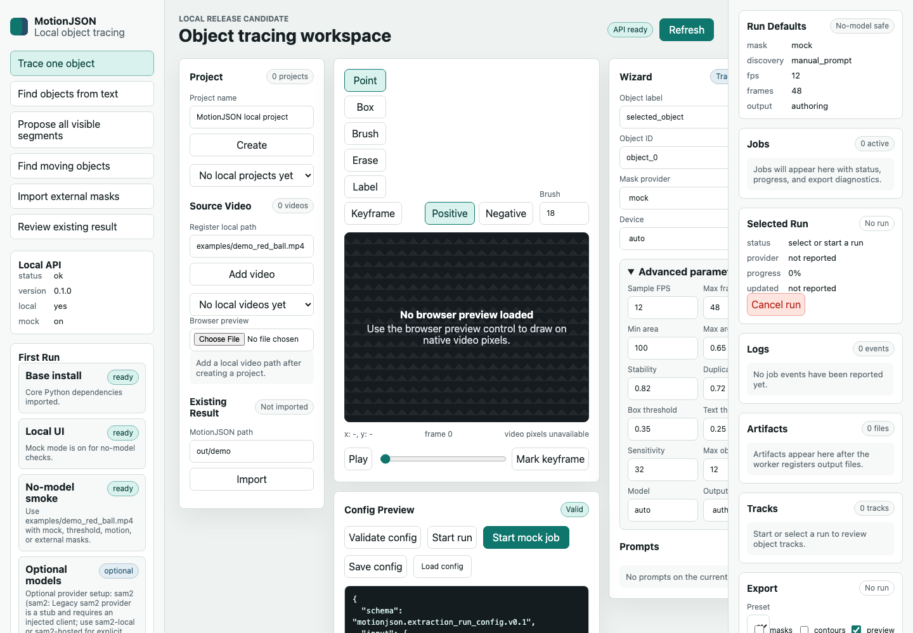
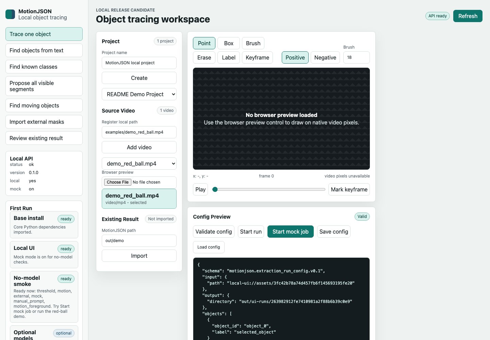
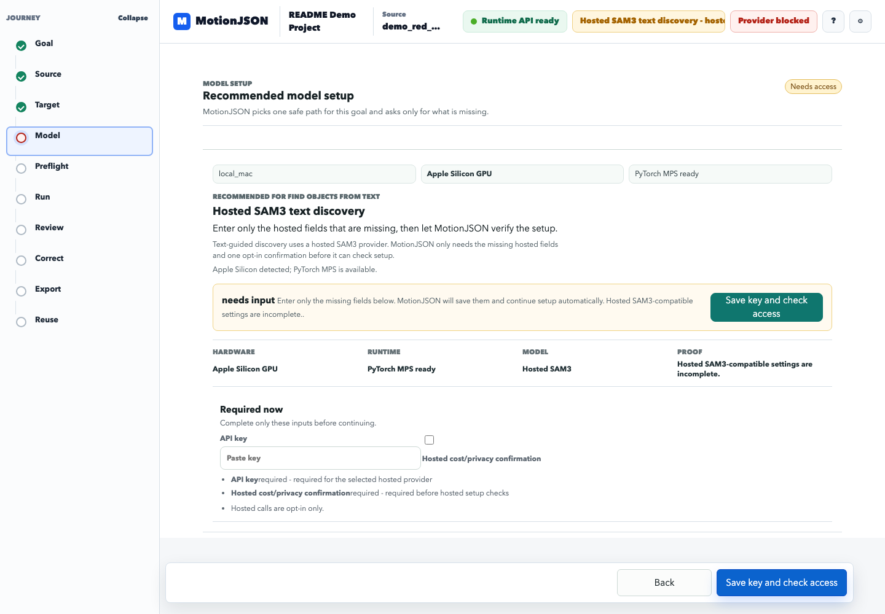
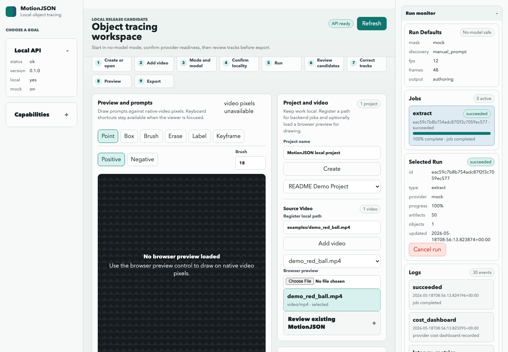
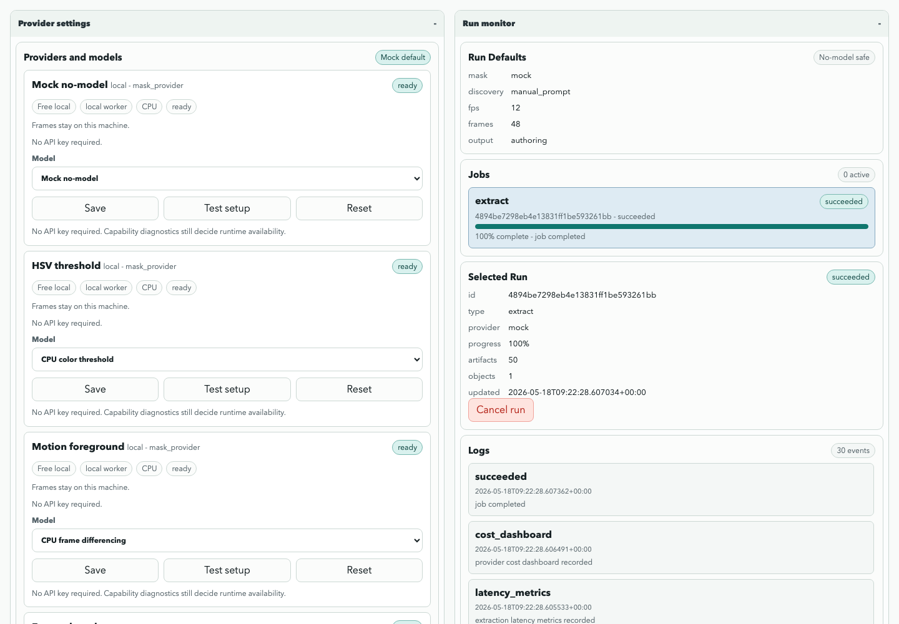
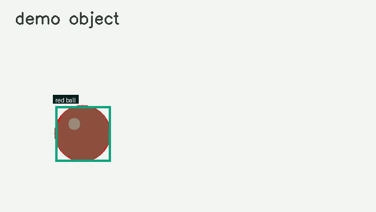
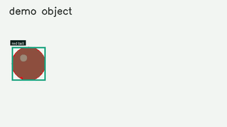

# MotionJSON

Turn selected video objects into reusable motion layers for editors and websites.

[](https://codespaces.new/ptse8204/json-animated-video)
[](https://colab.research.google.com/github/ptse8204/json-animated-video/blob/main/notebooks/colab_red_ball_cli_demo.ipynb)

MotionJSON helps you cut a moving object out of a video once, review the result,
and reuse it as a JSON-controlled layer. The practical output is cached
raster/alpha media plus compact JSON for timing, transforms, identity, review
state, rights metadata, and web playback.

Start with the Local UI. The normal path is goal-first: choose a task, add a
video, use **Model setup** to install/check/cache the recommended SAM provider,
run extraction, recover from failures, review, and export. CPU-only threshold
demos still exist for sanity checks, and debug mock mode is reserved for
contributor smoke tests.



## What it does

- Samples short videos with OpenCV.
- Extracts object layers with local providers such as SAM2, HSV thresholding,
  motion foreground, and external mask imports.
- Discovers object candidates through an API-first review flow: run a clean
  proposal pass, inspect backend-returned candidates, select desired objects,
  track selected candidates, then export reviewed motion layers.
- Keeps heavyweight ML paths optional and capability-gated.
- Shows provider diagnostics before a run, including missing SAM2, CUDA,
  detectors, hosted endpoints, FFmpeg, and model paths.
- Writes MotionJSON scene files, object manifests, masks, alpha cutouts,
  spritesheets, preview files, rights metadata, fallback diagnostics, and export
  manifests.
- Provides a local UI and local backend surfaces for projects, jobs, review,
  correction, and export.
- Ships JavaScript runtime and SDK packages for using generated assets in web
  pages.

## What it is not

MotionJSON is not a magic "video to JSON/SVG/Lottie" converter. Photoreal video
objects usually contain texture, blur, shadows, hair, reflections, and edge
detail that do not become clean SVG or Lottie. MotionJSON keeps those objects as
raster/alpha assets and controls them with JSON. Vector-like output is best for
silhouettes, contours, labels, icons, annotations, and simple flat graphics.

SAM2 is also not automatic semantic discovery by itself. Text prompts need a
detector or open-vocabulary candidate provider before segmentation/tracking.

## Default object discovery workflow

The default workflow is low-cost and review-first:

```text
Discover objects with Clean settings
-> review API-returned object candidates
-> select the objects you want
-> track selected candidates
-> export reviewed JSON-controlled motion layers
```

Clean discovery is the default because it samples a few keyframes, caps
candidates, filters whole-frame/background-like masks, and tracks selected
objects only. Maximum Recall is an advanced preset for missed objects; it uses
more keyframes, looser filters, and more candidates, so it is slower and
noisier. Trace Everything is expert/experimental, requires explicit
cost/noise acknowledgement, stays capped, and remains review-gated before
export.

When configured, SAM3 Scene Sweep is the recommended path for "find everything
in scene": the UI installs/checks the independent Transformers runtime, caches
`sam3TrackerModel=facebook/sam3` or a local Hugging Face model directory, and
then runs keyframe automatic masks plus video tracking. SAM2 prompt tracking is
still the practical local path for cutting out one prompted object, and SAM2 HF
automatic masks are offered as the scene-sweep fallback. Hosted SAM2/SAM3-style
providers require explicit cost/privacy opt-in before network tests or hosted
runs.

## Which path should I choose?

| Path | Best first use | Requirements and cautions |
| --- | --- | --- |
| CPU/no-model demo | First install check, `Use demo video`, simple CLI threshold demo, `Find moving things`, or `Import masks`. | Python `>=3.10`; 4 GB RAM minimum for tiny demos, 8 GB recommended; no GPU, model weights, or keys. |
| Local SAM2 | `Cut out one object` with point/box prompts while keeping frames local. | Install/configure SAM2, checkpoint, config, torch/CUDA; 16 GB RAM minimum for small clips, 32 GB recommended; 8 GB VRAM can work for small experiments, 12-16+ GB recommended. |
| SAM2 HF automatic masks | Fallback for `Find everything in scene` when SAM3 Scene Sweep is blocked. | Uses `facebook/sam2.1-hiera-large` through the independent Transformers path; does not require the official `sam2` package/checkpoint setup. |
| Hosted SAM2 | SAM2-style tracing without local GPU. | Requires API key, hosted-call opt-in, cost/privacy acknowledgement, and a compatible hosted profile such as `Replicate SAM2 video`. |
| SAM3 Scene Sweep | `Find everything in scene` with local automatic masks and tracker-video propagation. | Use the UI Model setup actions for install, cache, access check, and smoke test. Default tracker model is `facebook/sam3`; a local Hugging Face `from_pretrained` directory is allowed. A single `sam3.pt` file is not valid for this path. |
| SAM3 concept/exemplar | Prompted concept or exemplar discovery on your own CUDA machine. | Advanced local path only when official SAM3 package, Python/CUDA runtime, and a real local `sam3.pt` pass diagnostics; 32 GB RAM and 16+ GB VRAM are conservative starting points. |
| Hosted SAM3 | Text/concept segmentation without local SAM3 hardware. | Requires API key and explicit hosted opt-in for `Roboflow SAM3`, `Fal SAM3 image`, or a custom endpoint. Enable scene sweep only for hosted profiles that explicitly advertise automatic masks. |
| Motion foreground | CPU moving-object pass on a stable short clip. | No model required; camera motion, shadows, and reflections can become false foreground. |
| External masks | You already have masks from another tool. | No model required; mask folders/manifests must line up with video frames and object IDs. |

See [docs/system_requirements.md](docs/system_requirements.md) for the full
hardware, Colab, SAM2, SAM3, FFmpeg, and Node guidance.

## Who it is for

- Creators and editors who want reusable object cutouts from short clips.
- Web developers who want motion layers they can embed without rerunning AI.
- Motion designers who want JSON-controlled timing and transforms over cached
  media.
- Computer-vision experimenters who need visible provider diagnostics and
  explicit debug smoke paths.
- Contributors using Codex to continue the local-first object tracing roadmap.

## 30-second quick start: Local UI and Model setup

After cloning and entering the repository, the one-script path is:

```bash
scripts/first_run_local.sh
```

Manual path:

```bash
git clone https://github.com/ptse8204/json-animated-video.git
cd json-animated-video
python3 -m venv .venv
source .venv/bin/activate
python3 -m pip install -U pip
python3 -m pip install -e ".[ui]"
python3 -m motionjson.cli backend diagnostics --json
python3 -m motionjson.cli ui --no-open
```

Open the printed local UI URL. The workspace guides you through goal, project,
video, model setup, prepared input, run monitoring, review, correction, and
export one step at a time. The visible UI steps are `Start`, `Video`,
`Model setup`, `Prepare & run`, `Run`, and `Review & export`. In **Model
setup**, use the recommended path shown for the goal: SAM2 prompt tracking for
one-object cutout, SAM3 Scene Sweep for everything-in-scene, SAM2 HF automatic
masks as the fallback, SAM3 concept for text prompts, or no model for reviewing
an existing result. After a run starts, the main workspace switches to **Run
monitor** so active, failed, canceled, and completed jobs stay visible. Use
`Advanced` for diagnostics, raw config, local paths, custom endpoints, and
manual fallback details.

Contributor-only debug smoke checks use:

```bash
python3 -m motionjson.cli ui --no-open --debug-mock
```

Windows PowerShell uses the same module command after activating a venv:

```powershell
py -3 -m venv .venv
.\.venv\Scripts\Activate.ps1
python -m pip install -U pip
python -m pip install -e ".[ui]"
python -m motionjson.cli ui --no-open
```

## CLI demo: red ball extraction

```bash
python3 examples/make_demo_video.py --out examples/demo_red_ball.mp4
python3 -m motionjson.cli extract examples/demo_red_ball.mp4 \
  --out out/demo_red_ball \
  --mask-provider threshold \
  --lower-hsv 0,80,80 \
  --upper-hsv 12,255,255 \
  --sample-fps 12 \
  --max-frames 12
python3 -m motionjson.cli validate out/demo_red_ball
```

Expected result: one accepted red-ball object track, sampled frames, masks,
alpha cutouts, MotionJSON files, preview assets, and diagnostics under
`out/demo_red_ball/`.

Optional browser preview:

```bash
python3 -m http.server 8080
```

Then open
`http://localhost:8080/examples/canvas_player.html?scene=/out/demo_red_ball/web_asset_manifest.json`.

## Docker and local API

Run the local backend API without the UI:

```bash
python3 -m motionjson.cli backend init
python3 -m motionjson.cli backend serve-api \
  --db .motionjson/backend.sqlite \
  --storage-root .motionjson/storage \
  --host 127.0.0.1 \
  --port 8765
```

Docker paths are local and use SQLite plus filesystem storage:

```bash
docker build -t motionjson-ga .
docker run --rm -p 8765:8765 -v motionjson-data:/data motionjson-ga
```

```bash
docker compose config
docker compose up --build
```

## Free ways to try it

### GitHub Codespaces

Codespaces should use the real UI first, then connect hosted providers or
CPU-friendly local paths according to the available hardware:

```bash
python3 -m pip install -e ".[ui]"
python3 -m motionjson.cli backend diagnostics --json
python3 -m motionjson.cli ui --no-open --host 0.0.0.0
```

This repository includes `.devcontainer/devcontainer.json` for Codespaces. It
installs Python and Node dependencies after the container starts; then use the
forwarded UI port from the Codespaces Ports panel. The full low-install guide
is [docs/run_free_instances.md](docs/run_free_instances.md).

### Google Colab notebooks

Colab is useful for short interactive demos and generated-file inspection. It
is not the right place to host a long-running public MotionJSON web service.
Use the checked-in notebooks for the safe first paths:

- [Colab local UI notebook](notebooks/colab_ui_local_demo.ipynb)
  [](https://colab.research.google.com/github/ptse8204/json-animated-video/blob/main/notebooks/colab_ui_local_demo.ipynb):
  clones the
  repo, installs the lightweight UI extra, creates the deterministic red-ball
  video, runs provider diagnostics, starts the debug no-model UI path, and
  displays `/ui/` through Colab's notebook port proxy.
- [Colab provider-connect UI notebook](notebooks/colab_ui_provider_connect_demo.ipynb)
  [](https://colab.research.google.com/github/ptse8204/json-animated-video/blob/main/notebooks/colab_ui_provider_connect_demo.ipynb):
  installs the lightweight UI, launches the same main Local UI, and expects
  users to configure SAM3 Scene Sweep, SAM2 HF fallback, SAM2 prompt tracking,
  hosted providers, cache actions, and smoke tests from Model setup. Notebook
  SAM package/checkpoint cells are advanced fallback/debugging only.
- [Colab red-ball CLI notebook](notebooks/colab_red_ball_cli_demo.ipynb)
  [](https://colab.research.google.com/github/ptse8204/json-animated-video/blob/main/notebooks/colab_red_ball_cli_demo.ipynb):
  runs
  the compact CPU/no-model threshold extraction, validation, and ZIP download
  path.
- [Colab export and browser preview notebook](notebooks/colab_red_ball_export_preview.ipynb)
  [](https://colab.research.google.com/github/ptse8204/json-animated-video/blob/main/notebooks/colab_red_ball_export_preview.ipynb):
  creates a website handoff ZIP and previews the generated runtime assets
  through Colab's port proxy.
- [Colab provider diagnostics notebook](notebooks/colab_provider_diagnostics.ipynb)
  [](https://colab.research.google.com/github/ptse8204/json-animated-video/blob/main/notebooks/colab_provider_diagnostics.ipynb):
  reports provider readiness and saves redacted diagnostics plus a no-model
  smoke extraction for support.

Keep shared notebooks free of private videos, provider credentials, API keys,
SAM checkpoints, hosted-service secrets, and other sensitive local artifacts.

### Hugging Face Space demo plan

A future Space should start with CPU Basic diagnostics, a tiny deterministic
demo video, no client-side secrets, and no paid GPU requirement. Real SAM2 or
hosted-provider demos should stay optional and clearly labeled. The concrete Space
handoff plan lives in [spaces/huggingface/README.md](spaces/huggingface/README.md).

## Screenshots and demos

These images are generated from explicit debug UI smoke checks and the
deterministic red-ball extraction. Regenerate them with:

```bash
python3 scripts/capture_docs_assets.py --check
python3 scripts/capture_docs_assets.py
```













Available local demo inputs today:

- `examples/demo_red_ball.mp4`
- `examples/make_demo_video.py`
- `examples/canvas_player.html`
- `examples/plain_js_embed.html`
- `examples/object_selection_workflow.html`
- `examples/timeline_editor.html`

## Output files explained

A typical extraction writes files like these:

```text
out/demo_red_ball/
  scene_graph.json
  object_motion.json
  web_asset_manifest.json
  resource_profile.json
  rights_manifest.json
  tracks.json
  fallback_diagnostics.json
  frames/
  masks/
  objects/
  preview/
```

Use `scene_graph.json` or `web_asset_manifest.json` for playback. Use
`tracks.json`, `provider_diagnostics.json`, and `fallback_diagnostics.json` to
understand what was accepted, rejected, or unavailable before export.
Discovered objects also carry a `discovery` block in scene/object/web
manifests. It records candidate source, provider, preset, review status,
selected tracking state, confidence/coverage scores, artifact lineage, and
export review state so runtimes and SDK clients do not need to reverse-engineer
`candidates.json`.
Review APIs also return `review.timeline` with API-owned candidate and track
markers plus suggested keyframes, so the UI scrubber can preview object
appearance/loss and reuse backend-derived keyframes without inventing results.

## Use MotionJSON on a website

Frontend developers can start with the generated `web_asset_manifest.json`
without reading the extraction backend. Serve the repository or an exported
package and open:

```text
http://localhost:8080/examples/plain_js_embed.html?manifest=/out/demo_red_ball/web_asset_manifest.json
```

The plain JavaScript embed uses the local `@motionjson/runtime` source from
`packages/motionjson-runtime`. It auto-mounts elements with
`data-motionjson-src`, renders cached raster/alpha media with JSON timing, and
does not call SAM2, detectors, hosted providers, or model APIs in the browser.

Use `web_asset_manifest.json` for a single object layer. Use
`scene_graph.json` for multi-object playback, layer order, and scene-level edit
state. Both formats reference local cutouts, spritesheets, preview assets,
rights metadata, and production assets when exports create them.

The local package checks are:

```bash
npm test
npm --workspace @motionjson/runtime run test
npm --workspace @motionjson/sdk run test
npm pack --dry-run --workspace @motionjson/runtime
npm pack --dry-run --workspace @motionjson/sdk
npm run embed:smoke
```

Use `@motionjson/sdk` when a web app needs to call the local/backend API:
`MotionJSONClient` can create projects, upload assets, start extractions,
create `website-zip` packages, and request `remotion-plan` render jobs. The SDK
is API orchestration code; website playback still belongs to
`@motionjson/runtime` or the copied `runtime/` folder in a website ZIP.

```bash
python3 -m motionjson.cli export out/demo_red_ball \
  --format website-zip \
  --out out/demo_red_ball/exports/website_package.zip
```

`website-zip` packages the runtime source, HTML previews, snippets, manifests,
cached object media, rights metadata, and production assets for static hosting
or handoff review. Validated UI exports also write `object_layer_pack.json` and
a selected-object website package so downstream users receive only reviewed
object layers plus copyable JavaScript, React, and Remotion handoff snippets.
`remotion-plan` is intentionally honest: it writes a JSON integration plan for
an application-owned Remotion adapter and does not install Remotion or generate
a component today.

## Provider options

| Provider or mode | Local/free? | Best for | Notes |
| --- | --- | --- | --- |
| `mock` | Yes | Contributor debug smoke checks | Deterministic no-model behavior when launched with `--debug-mock`. |
| `threshold` | Yes | Simple color demos | Good for the red-ball example. |
| `motion` / `motion_foreground` | Yes | Moving objects on simple backgrounds | CPU-friendly, rough by design. |
| `external` / `external_masks` | Yes | Masks from another tool | Import mask PNG/JPG/WebP sequences. |
| `sam3_auto_masks` | Optional local SAM3 Tracker runtime | Find everything in scene | Uses `sam3TrackerModel=facebook/sam3` or a local Hugging Face model directory. Never pass a single `sam3.pt` file to this Transformers path. |
| `sam2-hf-auto-masks` | Optional local Transformers runtime | Fallback automatic masks for scene sweep | Uses `facebook/sam2.1-hiera-large`; independent from official SAM2 prompt tracking. |
| `auto_object_proposals` | Local SAM2 or hosted/profiled SAM flow | Clean candidate gallery before selected tracking | Official local proposals require SAM2 automatic masks, torch, checkpoint, and config. |
| `sam2-local` | Optional | Promptable segmentation/tracking | Requires SAM2 package, torch, checkpoint, and config. |
| `sam2-hosted` | Optional | Explicit hosted segmentation experiments | Requires endpoint/auth and opt-in network use. |
| `sam3-local` / `sam3-hosted` | Optional | Scene sweep, concept, exemplar, and higher-recall discovery | Local scene sweep uses the independent Transformers tracker model. Official local concept/exemplar uses `sam3ModelPath`/`SAM3_LOCAL_MODEL` and a `sam3.pt` checkpoint. Hosted SAM3 requires endpoint/auth plus explicit network and cost/privacy acknowledgement. |
| `text_detector` | Optional/scaffolded | Text-guided candidates | Text becomes detector candidates before segmentation. |
| `class_detector` | Optional/scaffolded | Known-class candidates | Requires configured detector model. |
| `openrouter` | Optional | LLM/VLM reasoning or labels | Not a segmentation provider. |
| `openai-planner` | Optional | Text intent to reviewable run plan | Uses server-side OpenAI settings only after hosted opt-in and per-request cost/privacy acknowledgement. Not a segmentation provider. |

Run this before choosing a provider:

```bash
python3 -m motionjson.cli backend diagnostics --text
python3 -m motionjson.cli backend diagnostics --json
```

Diagnostics now separate `installed`, `configured`, and `runnable`. A provider
can be configured but not runnable, for example hosted segmentation with
credentials present but no explicit network opt-in. The normal Local UI worker
starts real configured providers such as local SAM2/SAM3, hosted SAM profiles,
`threshold`, `motion`, and `external` jobs. Mock jobs are available only when
the UI is launched with explicit `--debug-mock` for contributor smoke checks.

The Local UI Provider settings panel lets users bring their own hosted keys and
choose provider models without editing shell files. Raw keys are stored only in
the selected local SQLite database when a user chooses to save them, environment
variables still take precedence for CLI/headless use, and UI/API responses show
only redacted values. See [docs/security/api_keys.md](docs/security/api_keys.md).

## Troubleshooting

The full troubleshooting guide is [docs/troubleshooting.md](docs/troubleshooting.md).
Common first checks:

- `python: command not found`: use `python3` on macOS/Linux or `py -3` on
  Windows.
- Object discovery missed the thing you want: start with Clean, then retry with
  Maximum Recall only when the candidate gallery is too sparse.
- Object discovery found too much: stay in Clean or Balanced, use the API
  candidate filters, and track selected candidates only.
- Trace Everything is blocked: acknowledge the advanced cost/noise warning and
  expect review-required output before export.
- SAM2 is missing: use Model setup for SAM2 prompt tracking, choose SAM2 HF
  automatic masks as the scene-sweep fallback, link Replicate SAM2 video, or
  choose a CPU fallback such as `threshold`, `motion`, or `external`.
- SAM3 Scene Sweep rejects a `.pt` file: use `sam3TrackerModel=facebook/sam3`
  or a local Hugging Face model directory. Keep `sam3.pt` paths for Advanced
  official-package `sam3ModelPath` concept/exemplar setup.
- Text/class detectors are missing: install and configure the relevant detector
  only if you need those workflows.
- FFmpeg is missing: JSON and website assets can still work; MP4/WebM rendering
  needs FFmpeg.
- The output is raster-only: inspect `fallback_diagnostics.json` and
  `tracks.json`. Photoreal objects are expected to remain raster/alpha, but bad
  whole-frame masks should be flagged before export.
- The UI cannot find a video path: the local backend only registers files it
  can read from the machine running the server.

More docs:

- [Docs index](docs/index.md)
- [First run setup](docs/first_run.md)
- [Run locally](docs/run_local.md)
- [Run on free instances](docs/run_free_instances.md)
- [Examples](docs/examples.md)
- [System requirements](docs/system_requirements.md)
- [Troubleshooting](docs/troubleshooting.md)
- [Glossary](docs/glossary.md)
- [Local UI](docs/local_ui.md)
- [Provider capabilities](docs/provider_capabilities.md)
- [Provider API keys](docs/security/api_keys.md)
- [Discovery providers](docs/discovery_providers.md)
- [Track filtering](docs/track_filtering.md)
- [Runtime guide](docs/runtime.md)
- [Release checklist](docs/release_checklist.md)
- [Migration and known limitations](docs/migration_and_known_limitations.md)
- [Deployment guide](docs/deployment.md)
- [Repository status](docs/repo_status.md)

## Roadmap

The active roadmap for the guided Local UI, server-side model planning
connector, provider setup, review, export handoff, and Codex operations is
[`docs/roadmap/ui_model_connector_plan.md`](docs/roadmap/ui_model_connector_plan.md).
The earlier public-onboarding roadmap in `docs/codex_future_plan.md` and the
completed implementation history under `docs/roadmap/` remain useful
historical context. The latest launch-readiness summary is
[`docs/roadmap/final-audit.md`](docs/roadmap/final-audit.md).

Current release-candidate boundaries:

- the no-model local UI, red-ball CLI demo, benchmark fixtures, docs links,
  JavaScript runtime checks, and local API tests are covered by repeatable
  commands;
- guided Local UI flows, model setup, fake model planning, server-side OpenAI
  planning, reviewed-object export handoff, and Codex operational prompts are
  implemented as local-first, opt-in, review-gated workflows;
- SAM2, detector, hosted segmentation, OpenRouter, FFmpeg video rendering, and
  public hosted demos remain optional or environment-dependent;
- MotionJSON source code and package metadata are licensed under Apache-2.0;
  generated output rights still depend on the user's source videos, media
  rights, and export metadata.

## Contributing with Codex

Read `AGENTS.md`, `CODEX_MASTER_PROMPT.md`, `codex_tasks.yaml`, and
`docs/roadmap/ui_model_connector_plan.md` before making Local UI, model
connector, provider setup, guided review, export handoff, or Codex operational
changes. Treat `docs/codex_future_plan.md` as historical context unless a
maintainer explicitly selects that track. Work phase by phase, run the relevant
smoke commands, write a phase report, and commit each phase.

Contributor, release, and security docs:

- [Contributing](CONTRIBUTING.md)
- [Security policy](SECURITY.md)
- [Changelog](CHANGELOG.md)
- [Release checklist](docs/release_checklist.md)

The old root README planning packet was preserved at
`docs/codex/planning_packet.md` so Codex instructions are not lost.

## License

MotionJSON is licensed under the Apache License, Version 2.0. See
[LICENSE](LICENSE).

Generated MotionJSON assets retain the source-media rights and attribution
metadata recorded by the user or pipeline; the project license does not grant
rights to videos, images, model checkpoints, provider outputs, or third-party
media that users supply.
