# Local UI Audit

Phase 03A captured the pre-redesign Local UI with the existing docs asset
script, then replaced the shell with a commercial product layout and a repeatable
Chrome layout gate.

## Baseline Evidence

Baseline screenshots are real local UI captures from:

```bash
python3 scripts/capture_docs_assets.py --out-dir docs/design/screenshots/baseline
```

The viewport baseline matrix was captured from a detached temporary worktree at
the pre-redesign `HEAD` so the current working tree did not need to be reverted:

```bash
git worktree add --detach /tmp/motionjson-phase03a-baseline-worktree HEAD
PYTHONPATH=/tmp/motionjson-phase03a-baseline-worktree/src \
  node /tmp/motionjson-phase03a-baseline-worktree/scripts/check_local_ui_layout.mjs \
  --screenshot-dir docs/design/screenshots/baseline-matrix
```

Key baseline captures:

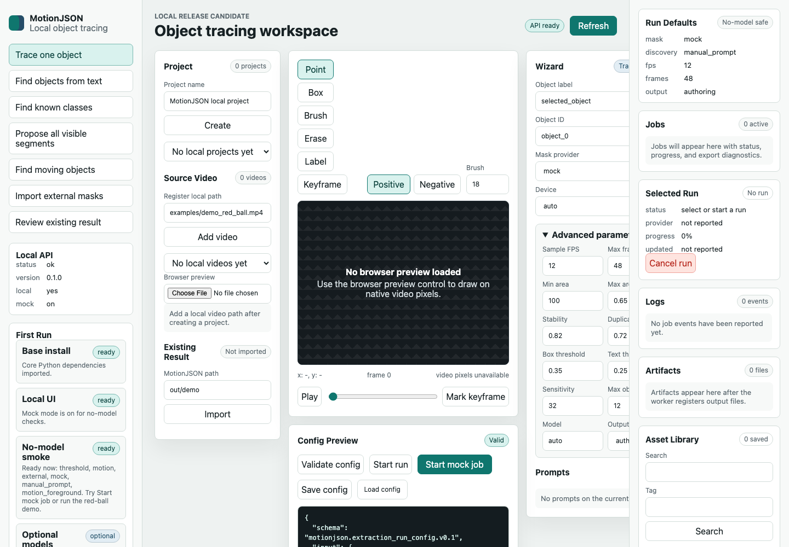

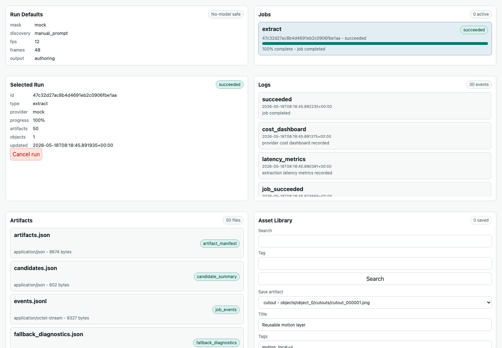

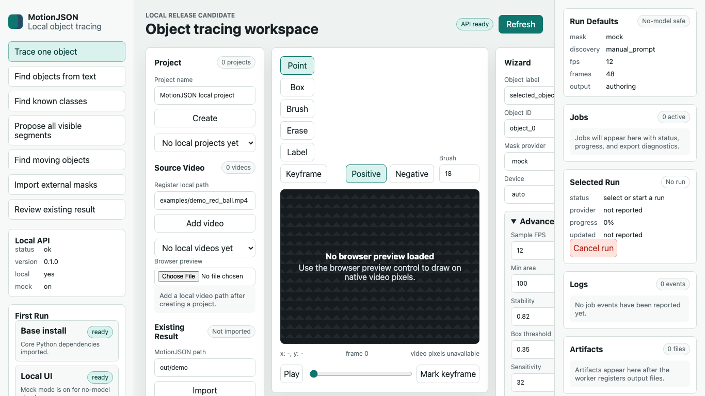

## Baseline Findings

- The first viewport exposed too many surfaces at once: project setup, viewer,
  wizard, config, first-run, capabilities, jobs, logs, artifacts, library,
  tracks, corrections, diagnostics, and routes.
- The 1440px desktop capture showed the wizard competing with the right rail,
  with narrow columns and clipped hierarchy.
- Advanced extraction parameters were open by default, so less-technical users
  had to read debug controls before they could follow the basic workflow.
- The right rail was a long stack of unrelated panels. Jobs, review, artifacts,
  corrections, asset library, and route diagnostics needed progressive
  disclosure.
- The shell relied on document-level scroll, which made project context,
  inspector context, and job state hard to keep in view.
- Accessibility basics existed: skip link, labels, keyboard shortcuts, and focus
  styles. The larger gap was layout predictability and information hierarchy.

## Redesign Evidence

The redesigned shell was validated with:

```bash
npm run ui:layout -- --screenshot-dir docs/design/screenshots/phase-03a
```

The check starts the mock/no-model UI, validates the real empty shell, seeds a
deterministic job-review state, validates the real seeded and fully expanded
shell, then captures docs states in headless Chrome. It verifies no horizontal
overflow or unintended side/panel overlap at:

- 1366x768 laptop
- 1440x900 desktop
- 1920x1080 desktop
- 1024x768 tablet-like width

Representative after captures:

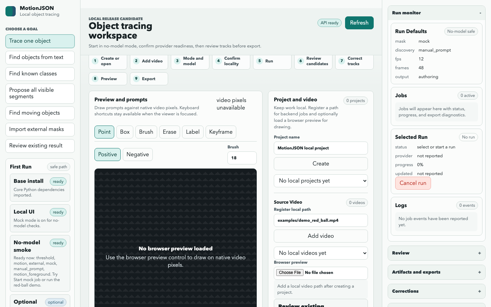

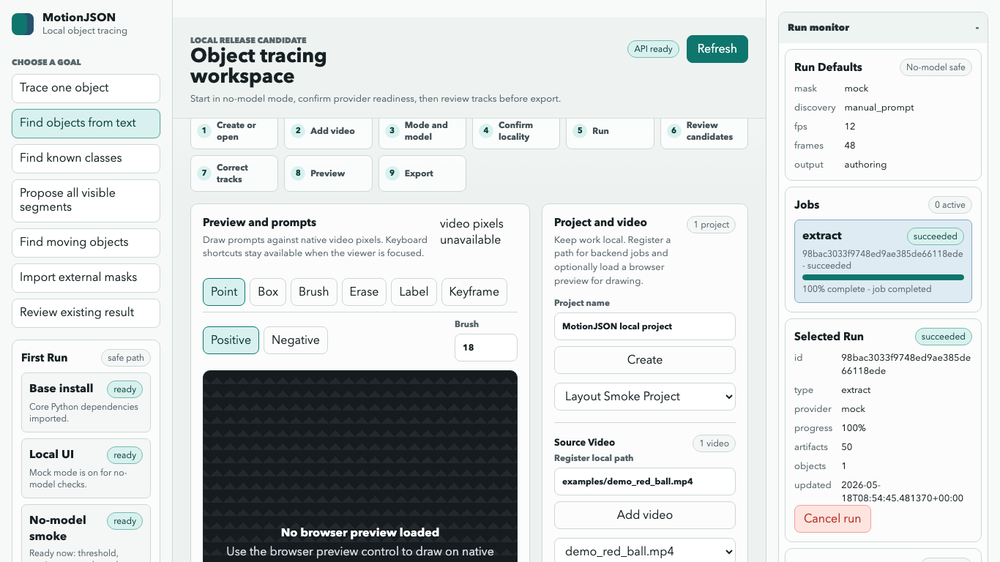

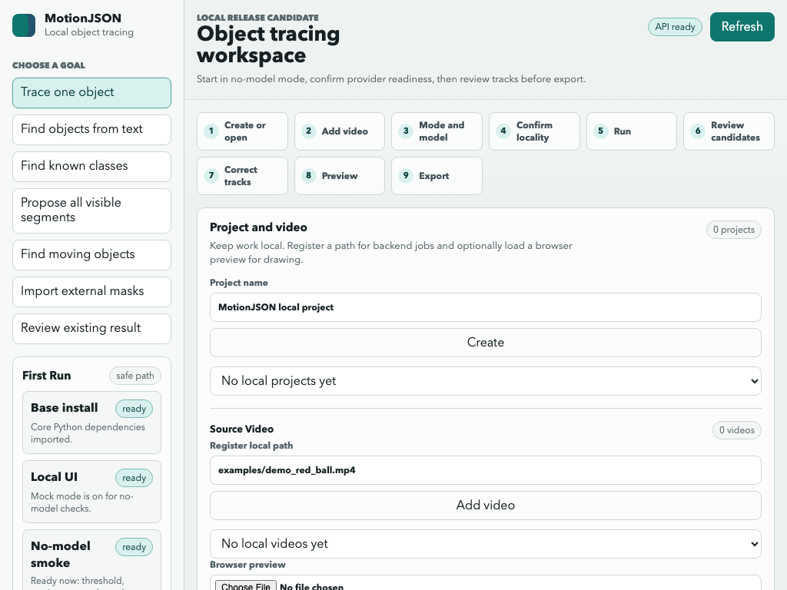

## Fixes Made

- Added a stable app frame with left goal navigation, main workspace, and a
  right inspector.
- Added a visible guided workflow strip: create/open, add video, choose
  mode/model, confirm locality, run, review candidates, correct tracks, preview,
  export.
- Moved provider warnings into the extraction settings panel, close to the
  action they affect.
- Collapsed diagnostics-heavy surfaces into native disclosure sections:
  run monitor, review, artifacts and exports, corrections, asset library, and
  routes.
- Closed advanced extraction parameters by default.
- Added independent scroll containers on desktop and responsive collapse at
  narrower widths.
- Added a Node/Chrome layout regression script that fails on horizontal overflow
  and unintended panel overlap.

## Known Compromises

- The UI remains a dependency-free static HTML/CSS/JavaScript app. This phase did
  not migrate to React or add a component runtime.
- The viewer, prompt tools, and backend API wiring remain the existing
  implementation. Phase 03A changed the product shell and validation surface, not
  extraction semantics.
- The mock job used by screenshot/layout validation can emit Python resource
  tracker semaphore warnings during shutdown. The layout command exits
  successfully when the UI passes.

## UI-LAYOUT-01 Evidence

UI-LAYOUT-01 revisited the commercial shell with the stricter model-connector
roadmap requirement: browser evidence across mobile-like, tablet, laptop, and
desktop widths, plus default, wizard, provider, review, export, and expanded
disclosure states.

Before evidence:

```bash
npm run ui:layout -- --screenshot-dir docs/design/screenshots/ui-layout-01-before
```

The stricter baseline captured 54 screenshots across:

- 390x844 mobile-like width;
- 768x1024 tablet portrait;
- 1024x768 tablet-like width;
- 1366x768 laptop;
- 1440x900 desktop;
- 1920x1080 desktop.

Baseline findings:

- 390px states had horizontal overflow from the sticky topbar margin.
- The `new-project` docs capture forced a desktop two-column shell on mobile.
- The `job-review` docs capture forced two right-rail columns on mobile.
- The default left rail exposed workspace details, first-run diagnostics, and
  local API details too early.
- Provider settings dominated the right rail before the user had chosen to
  configure providers.
- Fully expanded disclosure states squeezed diagnostic rows into narrow
  columns.

After evidence:

```bash
npm run ui:layout -- --screenshot-dir docs/design/screenshots/ui-layout-01
```

Representative captures:

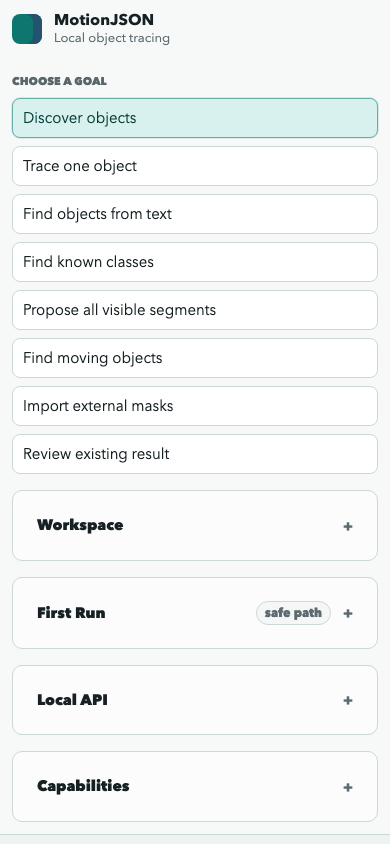

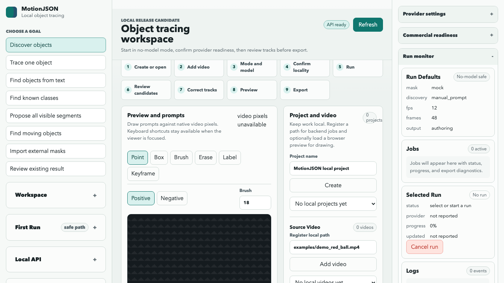

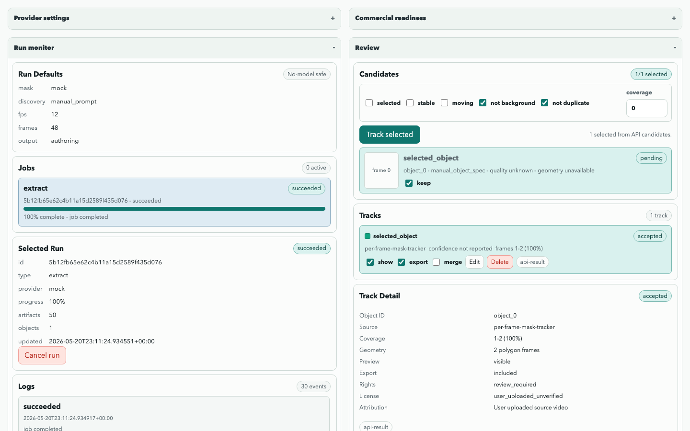

Fixes made:

- Added 390x844 and 768x1024 viewports to the repeatable layout gate.
- Added checks for horizontal overflow, panel overlap, clipped control text,
  visible focus style, and too-narrow main/inspector cards.
- Collapsed secondary left-rail sections by default so the first screen starts
  with goal choice instead of a diagnostics wall.
- Collapsed Provider settings by default and kept Run monitor as the primary
  right-rail status surface.
- Made docs capture modes responsive for mobile `new-project` and `job-review`
  states.
- Opened review/export sections in the `job-review` capture so candidate cards,
  track detail, and export surfaces are browser-validated.
- Widened the desktop/tablet sidebar enough for expanded first-run diagnostics
  to remain readable.
- Fixed 390px topbar overflow.

Known compromise:

- The right rail remains intentionally dense in expanded review/export states.
  This phase improves hierarchy and validation coverage without redesigning the
  review model or export handoff; those are covered by later UI-MODEL phases.

## UI-MODEL-01 Evidence

UI-MODEL-01 added a nontechnical first-run path on top of the UI-LAYOUT-01 shell.
The browser evidence now includes a dedicated `advanced-config` capture state so
the human-readable run plan and raw JSON disclosure are checked separately from
the fully expanded stress state.

Before evidence:

```bash
npm run ui:layout -- --screenshot-dir docs/design/screenshots/ui-model-01-before
```

After evidence:

```bash
npm run ui:layout -- --screenshot-dir docs/design/screenshots/ui-model-01
```

Representative captures:

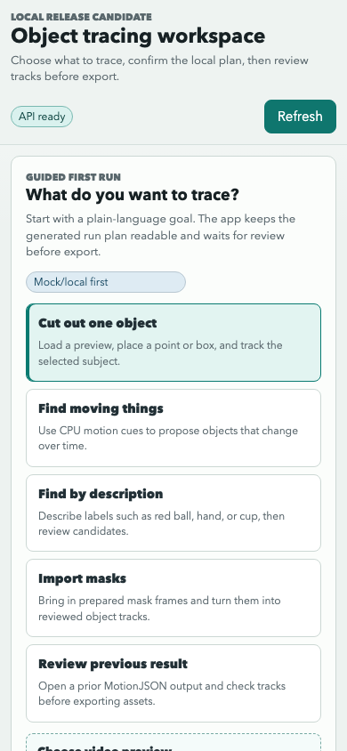

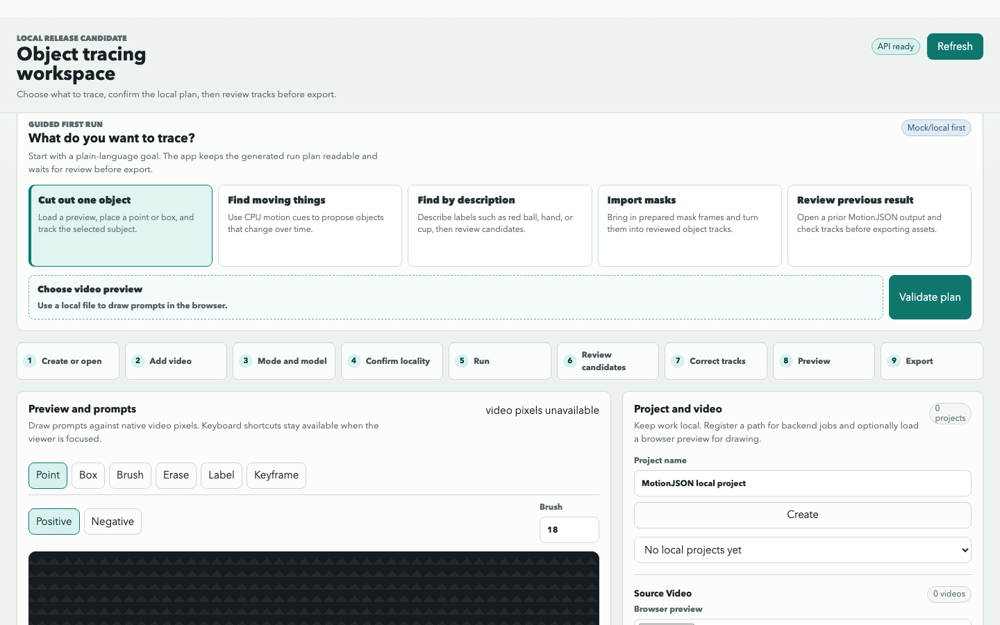

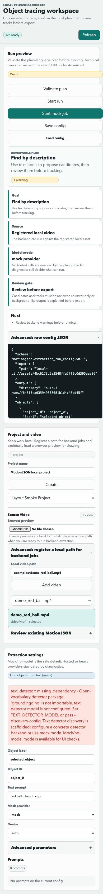

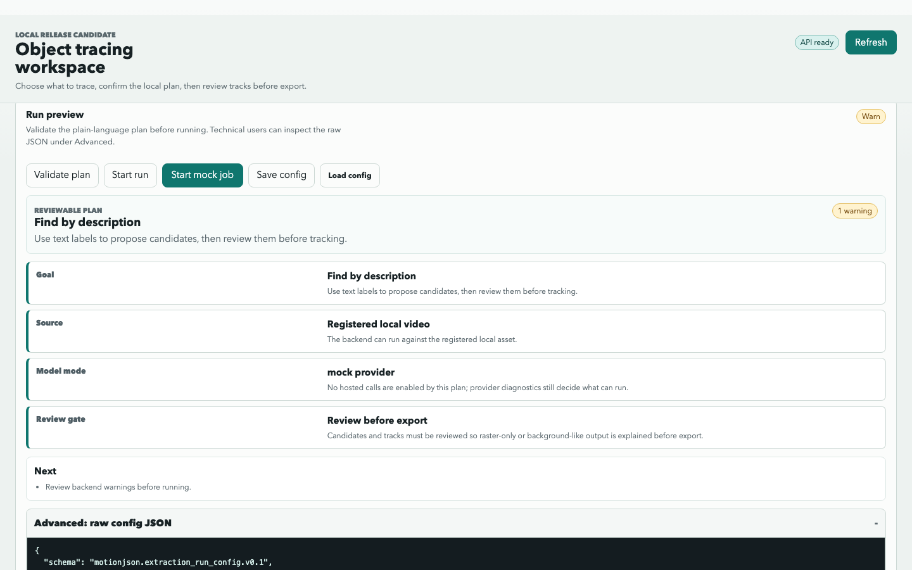

Findings and changes:

- The old default path still led with the sidebar goal list and local backend
  path fields. The new main-canvas wizard starts with plain-language goal cards.
- Browser preview is presented before backend path registration; local path
  registration remains available under Advanced for extraction jobs.
- The Run preview now explains goal, source readiness, provider mode, prompt
  needs, review gate, and next steps before showing raw JSON.
- Raw `ExtractionRunConfig` remains available under Advanced and is covered by
  the layout gate across the required viewport matrix.
- The mobile `advanced-config` state also writes a full-page screenshot so the
  raw JSON disclosure and backend local path disclosure are visible at 390px.

## UI-MODEL-05 Evidence

UI-MODEL-05 added a guided model setup panel to the main workspace so less
technical users can choose mock/local planning or hosted planning before
entering the dense Provider settings rail.

Before evidence:

```bash
npm run ui:layout -- --screenshot-dir docs/design/screenshots/ui-model-05-before
```

After evidence:

```bash
npm run ui:layout -- --screenshot-dir docs/design/screenshots/ui-model-05
python3 scripts/capture_docs_assets.py --out-dir docs/design/screenshots/ui-model-05-docs
```

Representative captures:

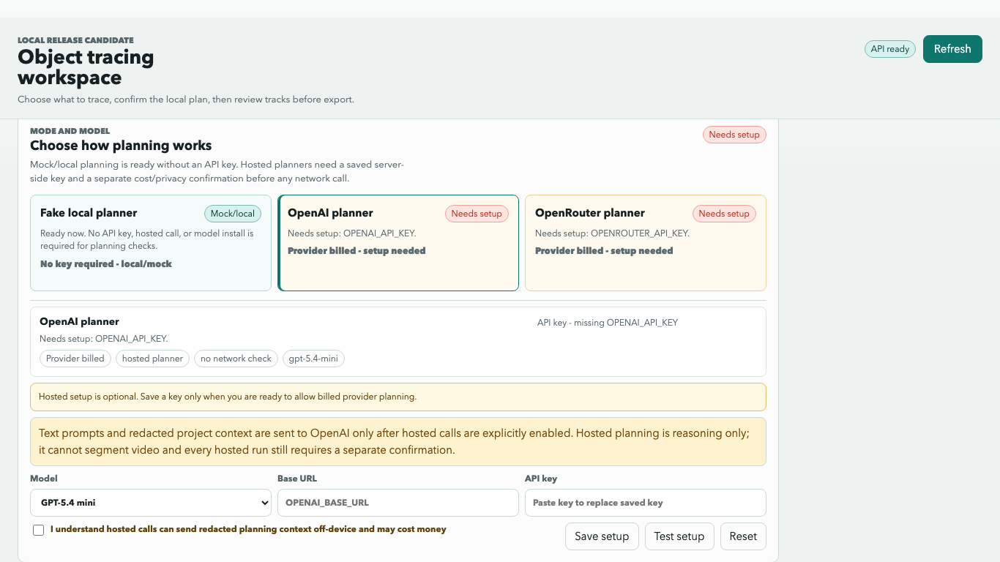

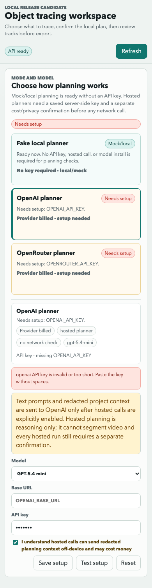

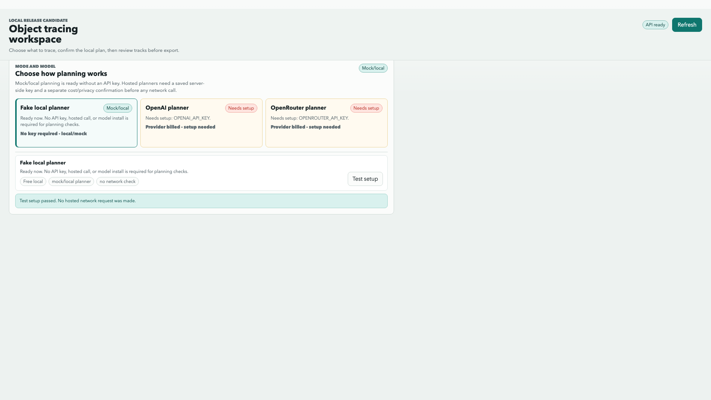

Findings and changes:

- The before state only exposed model/provider setup through the right-rail
  Provider settings list, which starts with local mask providers and requires
  scrolling before OpenAI/OpenRouter planning is visible.
- The after state adds a main-canvas Mode and model panel with local/mock first,
  hosted options second, and explicit missing-key, cost/privacy, and no-network
  test states.
- Model setup screenshots now cover empty/default, local selected, hosted
  warning, missing config, invalid config, and test success states across the
  required viewport matrix.
- Mobile model setup states also write full-page screenshots so the hosted
  detail, warnings, fields, acknowledgement, and actions are visible at 390px.
- The larger screenshot matrix initially exposed too-narrow model cards at
  1366px. The grid now drops columns before cards fall below the layout gate.
- Scout review found the hosted warning/error result and actions were too low
  in the laptop/mobile evidence. The result now appears above the hosted form,
  and desktop/laptop hosted fields use a compact three-column form.
- The headless layout script now closes Chrome targets between states and waits
  longer for capture readiness so the expanded model setup matrix can run
  repeatably.

## UI-UX-01 Evidence

UI-UX-01 added stricter product-quality checks to the layout gate after the
guided review flow passed structural checks while still showing real UX
failures.

Before evidence:

```bash
npm run ui:layout -- --state real-empty-shell,workflow-goal,workflow-video,prepare-sam3-trace-all-runtime-ready,workflow-run-asset-stalled,workflow-review,workflow-export,job-review --screenshot-dir docs/design/screenshots/ui-ux-01-before
```

Baseline findings:

- The mobile first-run and review states let the fixed workflow action bar cover
  goal/review cards.
- The desktop review/export states exposed more than one primary export action.
- The `job-review` docs capture rendered a details heading with no useful run,
  review, or diagnostics content.
- The existing layout gate detected overflow and overlap, but not blank active
  content, action occlusion, or duplicated export CTAs.

After evidence:

```bash
npm run ui:layout -- --state real-empty-shell,workflow-goal,workflow-video,prepare-sam3-trace-all-runtime-ready,workflow-run-asset-stalled,workflow-review,workflow-export,job-review --screenshot-dir docs/design/screenshots/ui-ux-01
```

Fixes made:

- Added layout assertions for blank `job-review` content, fixed workflow footer
  occlusion, missing export content, and duplicate primary export actions.
- Repaired the `job-review` capture to use the seeded review fixture instead of
  hiding the workspace behind an empty details rail.
- Moved the guided workflow action bar into normal document flow so it no longer
  covers cards at mobile or desktop widths.
- Demoted the duplicate studio header export button so the export checklist
  remains the single primary export action until the review/export redesign
  phase.

## UI-UX-02 Evidence

UI-UX-02 replaced the always-visible project rail with a contextual project
drawer. The default first-run surface now gives the guided workflow the full
viewport width, while project switching, workspace preferences, Local API
status, and capabilities remain available from the topbar project button.

Before evidence:

```bash
npm run ui:layout -- --state real-empty-shell,workflow-goal,workflow-video,nav-collapsed,diagnostics-open --screenshot-dir docs/design/screenshots/ui-ux-02-before
```

After evidence:

```bash
npm run ui:layout -- --state real-empty-shell,workflow-goal,workflow-video,project-drawer-open,nav-collapsed,diagnostics-open --screenshot-dir docs/design/screenshots/ui-ux-02
```

Findings and changes:

- The before state reserved a 214px project rail even when no project action was
  needed.
- The after state closes the project drawer by default and opens it only from
  the topbar project control.
- The drawer keeps existing project, workspace preference, Local API, and
  capability controls instead of duplicating project management elsewhere.
- Layout assertions now cover the default closed state and an explicit
  `project-drawer-open` state across all required viewports.
- Drawer controls expose stable `aria-controls`, update `aria-expanded`, hide
  closed content from assistive technology, close on Escape, and cycle keyboard
  focus while open.

## UI-MODEL-06 Evidence

UI-MODEL-06 added a model-plan confirmation panel between model setup and
manual extraction settings. The panel keeps model output reviewable: users
generate a plan, inspect planner/discovery/mask/privacy/cost/runtime facts,
see backend validation warnings, and only then confirm extraction.

Before evidence:

```bash
npm run ui:layout -- --screenshot-dir docs/design/screenshots/ui-model-06-before
```

After evidence:

```bash
npm run ui:layout -- --screenshot-dir docs/design/screenshots/ui-model-06
python3 scripts/capture_docs_assets.py --out-dir docs/design/screenshots/ui-model-06-docs
```

Representative captures:

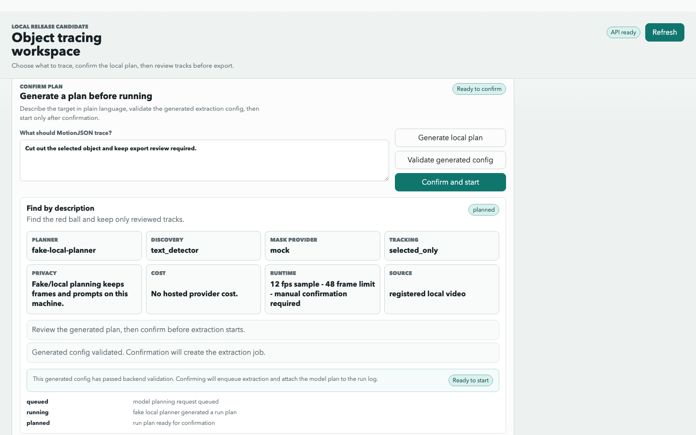

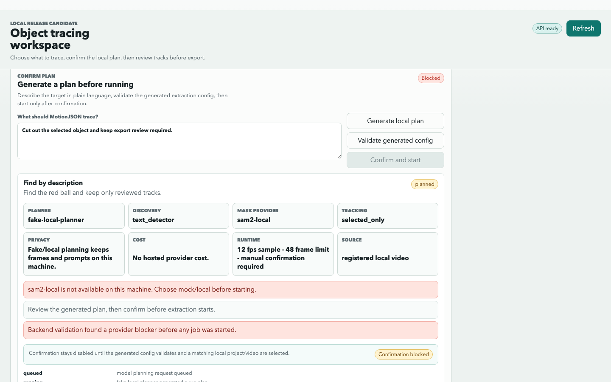

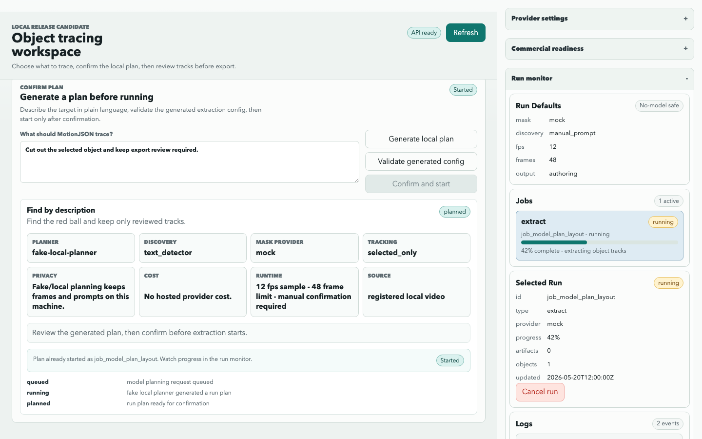

Findings and changes:

- The before state had a human-authored run preview but no server model-plan
  lifecycle in the main workflow.
- The after state adds model plan preview, validation warning, confirmation,
  queued, running, and succeeded capture states to the layout matrix.
- Confirmation remains disabled until the server-generated `runConfig` passes
  backend validation and a local project/video are selected.
- The job-state captures show the model plan panel beside the run monitor so
  `model_plan_attached`, worker start, and extraction progress are visually
  checked together.
- Probe screenshots exposed disabled primary buttons that still looked active
  and run-monitor cards that became too narrow beside the plan panel. Disabled
  button styling and the capture grid were adjusted before the final matrix.

## UI-MODEL-07 Evidence

UI-MODEL-07 upgraded the review path after extraction. Candidate cards now keep
stable preview slots, expose explicit review/export status chips, and render
plain-language retry suggestions. The correction panel now starts with
track-specific guidance, and the export panel states that only reviewed
selected tracks are included by default.

Before evidence:

```bash
npm run ui:layout -- --screenshot-dir docs/design/screenshots/ui-model-07-before
```

After evidence:

```bash
npm run ui:layout -- --screenshot-dir docs/design/screenshots/ui-model-07
python3 scripts/capture_docs_assets.py --out-dir docs/design/screenshots/ui-model-07-docs
```

Representative captures:

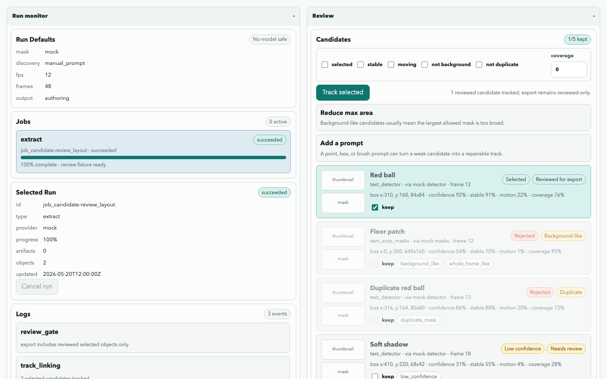

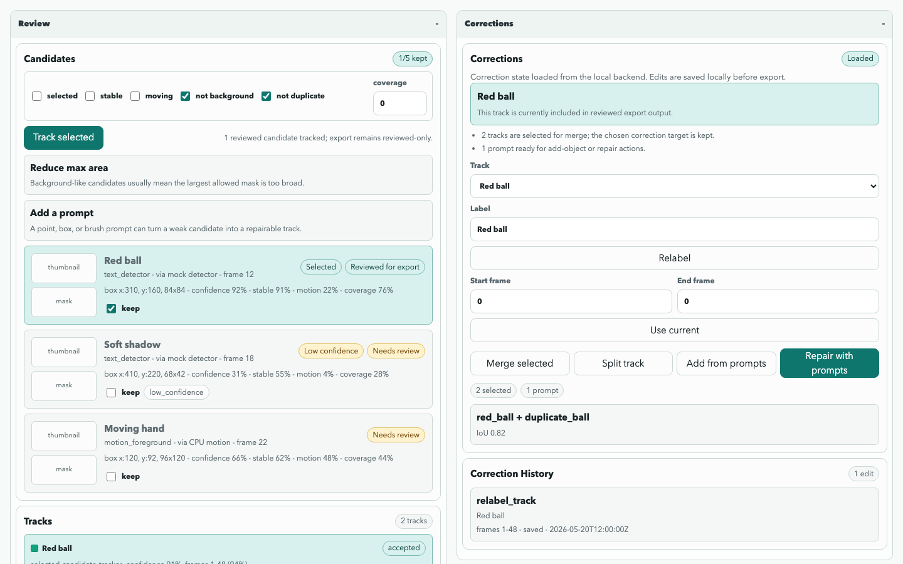

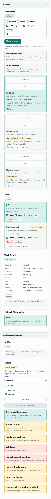

Findings and changes:

- The before matrix showed the API candidates, tracks, and export cards, but it
  did not isolate correction tools and only showed a pending/accepted candidate
  status path.
- The after matrix adds `candidate-review`, `correction-tools`, and
  `export-gate` states across 390x844, 768x1024, 1024x768, 1366x768,
  1440x900, and 1920x1080.
- Candidate review evidence now includes selected, rejected, background-like,
  duplicate, low-confidence, needs-review, and reviewed-for-export statuses.
- Correction evidence shows the selected track export state, merge readiness,
  prompt readiness, edit controls, duplicate merge suggestion, and correction
  history without unrelated right-rail sections competing for the first screen.
- Export evidence shows reviewed-selected-only inclusion, excluded/pending
  counts, validation issues, and rights warnings in plain language.

## UI-MODEL-08 Evidence

UI-MODEL-08 simplified the final handoff path. The export rail now opens with
destination cards instead of advanced toggles, so less technical users can
create or open the website package, reviewed scene, runtime snippet, Remotion
plan, or developer bundle without reading raw manifests first.

Before evidence:

```bash
npm run ui:layout -- --screenshot-dir docs/design/screenshots/ui-model-08-before
```

After evidence:

```bash
npm run ui:layout -- --screenshot-dir docs/design/screenshots/ui-model-08
python3 scripts/capture_docs_assets.py --out-dir docs/design/screenshots/ui-model-08-docs
```

Representative captures:

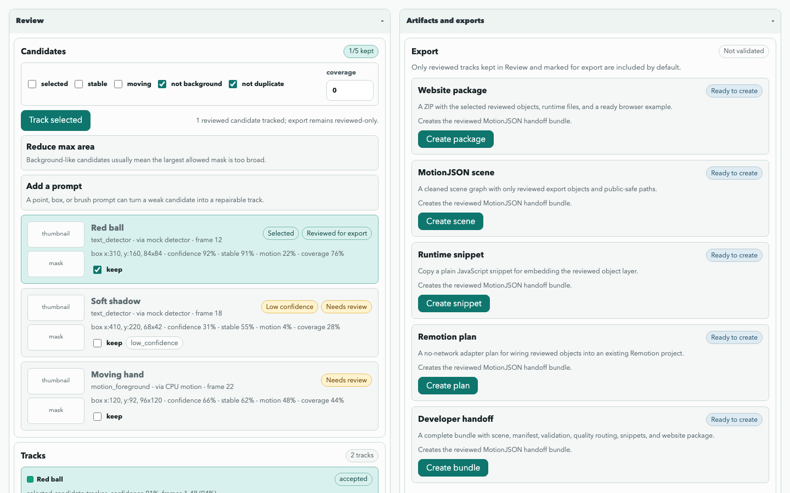


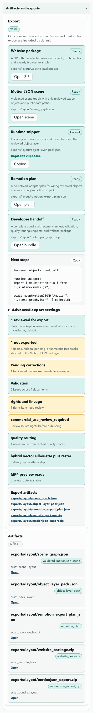

Findings and changes:

- The before state placed raw artifact lists and advanced export switches ahead
  of the handoff choices, so the primary export outcome was low in the rail.
- The after state moves Export above the raw artifact browser and keeps preset,
  mask, contour, and preview options inside Advanced export settings.
- Handoff cards clearly distinguish Ready to create, Needs review, and Ready
  states, and reuse the reviewed-selected validation gate from UI-MODEL-07.
- Successful exports show copyable next steps with the reviewed object IDs and
  runtime snippet, while still listing rights warnings, quality routing, and
  raw artifacts for developer inspection.
- Screenshot coverage now includes `export-handoff`, `export-success`, and
  `copyable-snippet` states across the required viewport matrix, with full-page
  mobile captures to verify the long handoff and artifact stacks.

## UI-UX-03 Evidence

UI-UX-03 added adaptive run defaults with visible expert override. The prepare
screen now shows tuned chips before raw advanced fields, and critical options
have hover/focus help labels.

Before evidence:

```bash
npm run ui:layout -- --state prepare-sam3-single,prepare-sam3-text,prepare-sam3-trace-all-runtime-ready,advanced-config --viewport mobile-390,desktop-1440 --screenshot-dir docs/design/screenshots/ui-ux-03-before
```

After evidence:

```bash
npm run ui:layout -- --state prepare-sam3-single,prepare-sam3-text,prepare-sam3-trace-all-runtime-ready,advanced-config --screenshot-dir docs/design/screenshots/ui-ux-03
```

Representative captures:

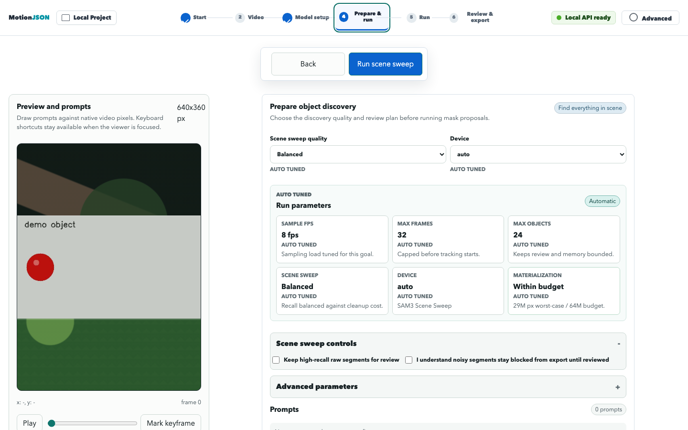

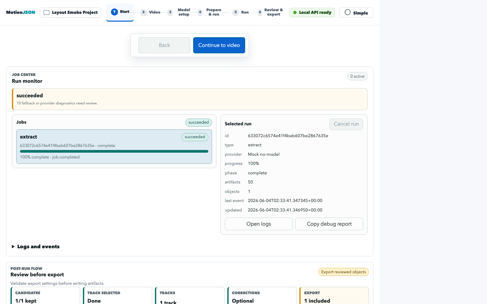

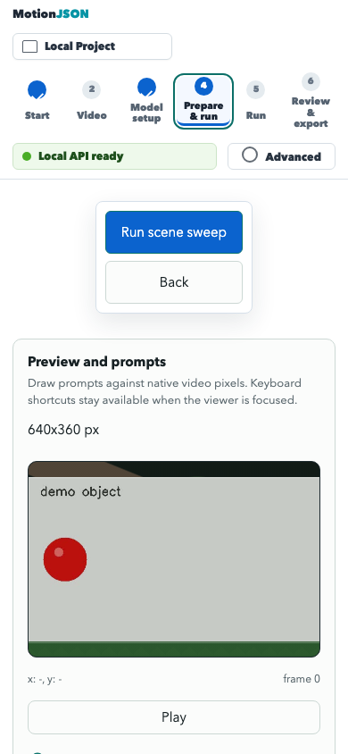

Findings and changes:

- The before prepare screens exposed raw controls but did not clearly explain
  which values were safe defaults and which were expert choices.
- The after prepare screens show auto-tuned sample FPS, max frames, max objects,
  scene sweep quality, device choice, and materialization budget/risk before
  advanced fields.
- Scene-sweep retries after asset-prep or heartbeat failures now default to a
  safer profile unless the user has explicitly overridden the field.
- Each tuned chip includes a keyboard-focusable tooltip and source label, and
  advanced fields show `Auto tuned` or `User override`.
- Layout checks now fail when prepare screens lose the auto-tuned chip set,
  critical help labels, or auto/override source labels.

## UI-UX-04 Evidence

UI-UX-04 repaired the Review and Export workspace split. The same
`review_export` workflow step now has a Review sub-screen for object decisions
and an Export sub-screen for package readiness, included objects, rights notes,
and handoff checks.

Before evidence:

```bash
npm run ui:layout -- --state workflow-review,workflow-export,job-review --viewport mobile-390,desktop-1440 --screenshot-dir docs/design/screenshots/ui-ux-04-before
```

After evidence:

```bash
npm run ui:layout -- --state workflow-review,workflow-export,workflow-partial-success,job-review --screenshot-dir docs/design/screenshots/ui-ux-04
```

Representative captures:

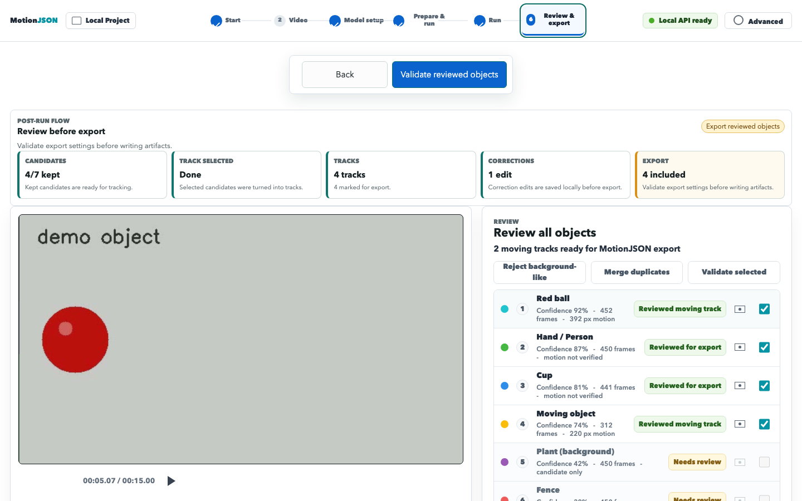

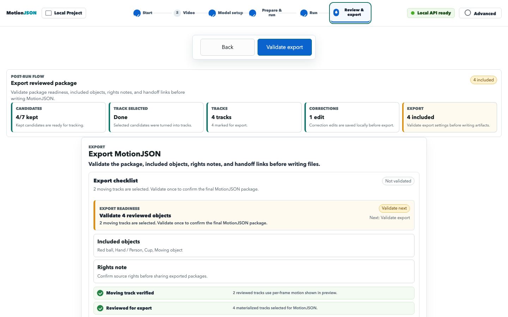

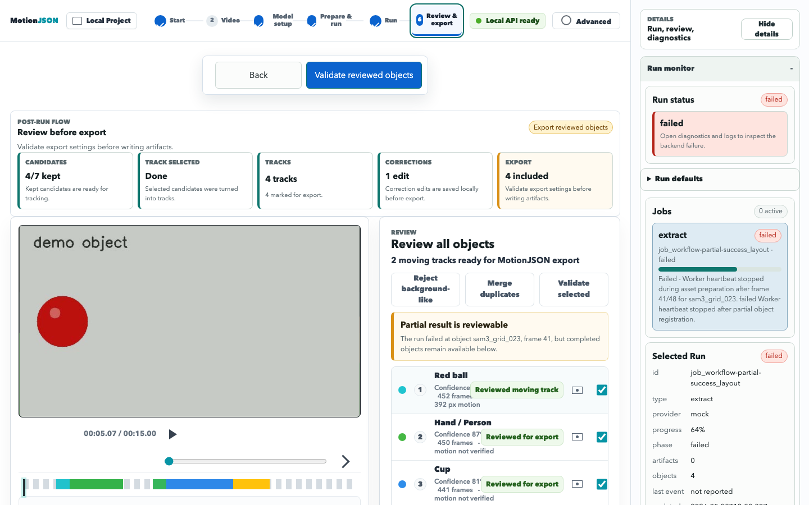

Findings and changes:

- The before `workflow-review` and `workflow-export` captures rendered the same
  object-review/export-checklist composition.
- The after Review capture keeps the viewer, object list, quality status chips,
  keep/export controls, and correction/review tools visible while hiding package
  readiness.
- The after Export capture removes the large viewer/object list and centers the
  export package checklist, included objects, rights note, and validation state.
- The new `workflow-partial-success` capture verifies that completed objects
  stay reviewable even when the selected job is terminal failed, and that the
  failed object/frame diagnostic is visible.
- Layout checks now fail if Review and Export show the same primary content, if
  Review loses object rows, if Export loses included-object/rights content, or
  if partial-success diagnostics disappear.

## UI-UX-05 Evidence

UI-UX-05 extracted stable Local UI state decisions into a small dependency-free
selector module while preserving the static app and `MotionJSONUI` public
helper surface.

Before evidence:

```bash
npm run ui:layout -- --state workflow-goal,prepare-sam3-trace-all-runtime-ready,project-drawer-open,workflow-review,workflow-export,workflow-partial-success --viewport mobile-390,desktop-1440 --screenshot-dir docs/design/screenshots/ui-ux-05-before
```

After evidence:

```bash
npm run ui:layout -- --state workflow-goal,prepare-sam3-trace-all-runtime-ready,project-drawer-open,workflow-review,workflow-export,workflow-partial-success --screenshot-dir docs/design/screenshots/ui-ux-05
```

Representative captures:

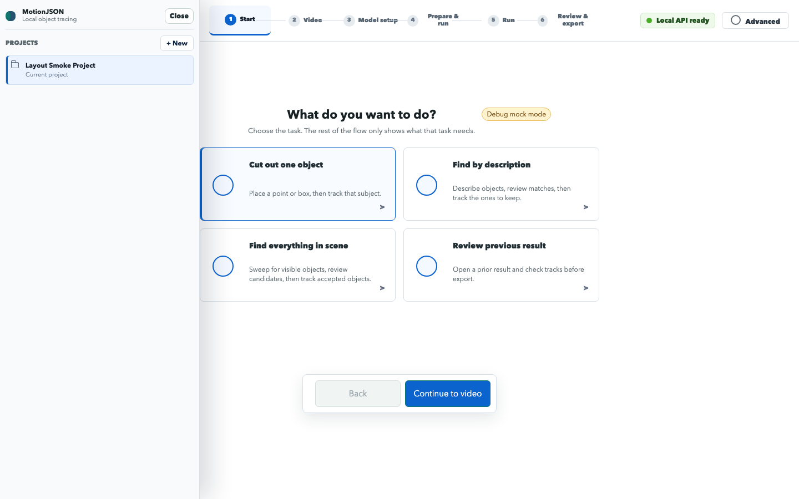


Findings and changes:

- The before state was visually acceptable, but adaptive parameters, project
  drawer accessibility, help copy, and Review/Export screen labels still lived
  inside the large `app.js` file.
- The after state uses `ui_selectors.js` for adaptive defaults, project drawer
  accessibility state, Review/Export headings and summaries, and critical
  option help text.
- `app.js` still owns DOM reads, API calls, focus movement, and rendering, but
  consumes selector outputs for these stable state decisions.
- `scripts/build_ui_shell.mjs` now checks the selector module, and the Node UI
  tests verify that the same helpers are exposed through `MotionJSONUI`.
- The concise UI contract is documented in `docs/design/local-ui-contract.md`
  to reduce future context required for UI changes.
