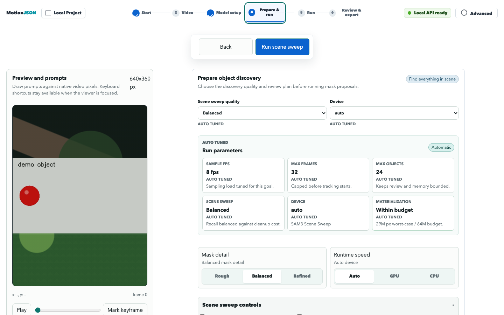
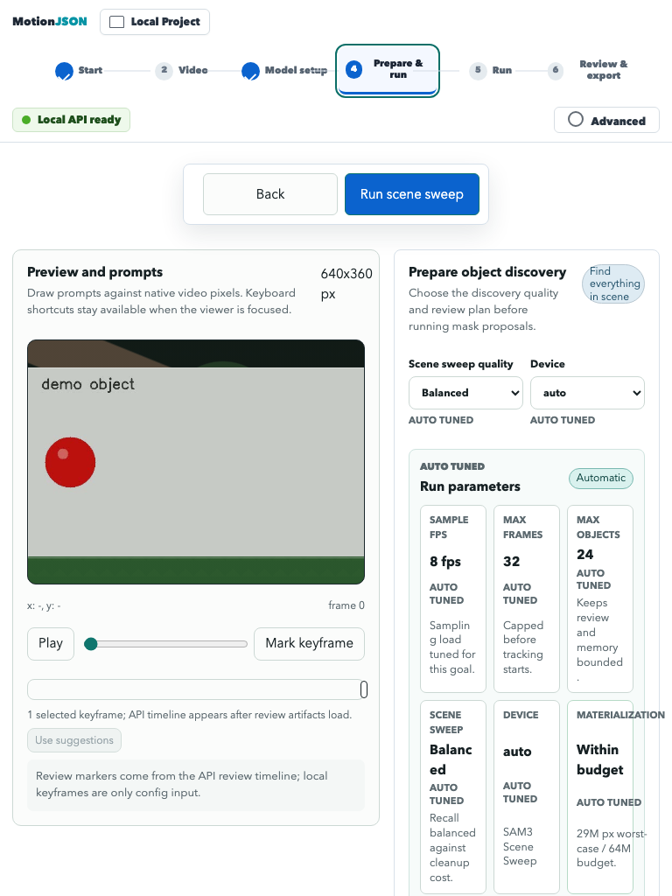
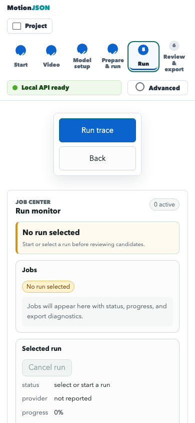

# Phase UI-UX-06 Report: Completion Reconciliation And Guided Refinement Controls

## Summary

- Fixed a backend race where a user cancel request after artifact-level success
  could move the database row to `cancel_requested`, leaving the UI stuck at
  `running`/`extracting` even after `job_succeeded`.
- Normalized Local UI lifecycle rendering so a `job_succeeded` or `succeeded`
  event makes stale active rows terminal and 100% complete.
- Added guided scene-sweep controls for `Mask detail` and `Runtime speed`, wired
  to the existing `discoveryQualityPreset` and `deviceSelect` run config fields.
- Updated adaptive defaults so SAM3 local scene sweep auto-selects CUDA when
  diagnostics prefer CUDA, while keeping user overrides intact.
- Strengthened static and layout tests for the new controls, including mobile
  label clipping and tablet segmented-control wrapping.

## Changed Files

- `src/motionjson/backend/queue.py`
- `src/motionjson/backend/job_lifecycle.py`
- `src/motionjson/ui/static/app.js`
- `src/motionjson/ui/static/app.css`
- `src/motionjson/ui/static/index.html`
- `src/motionjson/ui/static/ui_selectors.js`
- `scripts/build_ui_shell.mjs`
- `scripts/check_local_ui_layout.mjs`
- `scripts/test_ui_config_builder.mjs`
- `tests/test_job_artifacts.py`
- `tests/test_job_lifecycle.py`
- `tests/test_ui_first_run_simplicity.py`
- `docs/design/local-ui-audit.md`
- `docs/design/screenshots/ui-ux-06/`

## Evidence

- Backend baseline was the user debug report generated
  `2026-06-04T04:18:21.432Z`: `status: running`,
  `rawStatus: cancel_requested`, `progress: 100%`, with a prior
  `job_succeeded` event and a later `cancellation_requested` event.
- Visual baseline uses the committed UI-UX-05 scene-sweep screenshots plus the
  user report for the run-monitor stuck state.
- After evidence:

```bash
npm run ui:layout -- --state prepare-sam3-trace-all-runtime-ready,workflow-run,workflow-review --screenshot-dir docs/design/screenshots/ui-ux-06
```

Representative captures:







## Tests Run

- `node scripts/test_ui_config_builder.mjs`
- `python3 -m pytest -q tests/test_job_artifacts.py tests/test_job_lifecycle.py tests/test_ui_first_run_simplicity.py`
- `npm test`
- `npm run build`
- `npm run ui:layout -- --state workflow-run --viewport mobile-390 --screenshot-dir docs/design/screenshots/ui-ux-06`
- `npm run ui:layout -- --state prepare-sam3-trace-all-runtime-ready,workflow-run,workflow-review --screenshot-dir docs/design/screenshots/ui-ux-06`
- `python3 -m pytest -q tests/test_backend_jobs_worker.py tests/test_job_lifecycle.py tests/test_track_filtering.py tests/test_job_artifacts.py`
- `python3 -m pytest -q tests/test_ui_first_run_simplicity.py tests/test_phase03a_local_ui_layout.py`
- `python3 -m motionjson.cli --help`
- `python3 -m motionjson.cli extract --help`
- `git diff --check`

## Known Limitations

- The layout tool still prints a Python `resource_tracker` leaked semaphore
  warning during shutdown, but the layout command exits successfully.
- This phase verifies CUDA selection through UI/config state and diagnostics
  defaults. It does not run a real GPU SAM3 extraction.
- Mask refinement is still bounded by SAM3 automatic-mask candidate quality.
  `Refined` increases recall and review burden; users may still need to reject
  bad candidates or use a more specific workflow when the automatic proposal is
  semantically wrong.

## Follow-Up Tasks

- Add a run-monitor fixture that explicitly shows stale `cancel_requested`
  rows with a prior success event as completed, once a debug capture fixture for
  this exact state is useful.
- Continue improving review-time mask correction so `Refined` candidate
  discovery pairs with faster reject/keep decisions.
- Consider a provider diagnostic line that explicitly says whether the active
  run used CPU, CUDA, or MPS after model startup, not only what the config
  requested.
