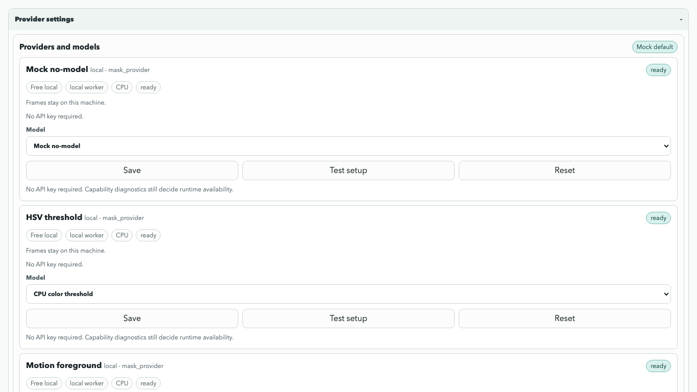

# Provider API Keys

MotionJSON runs without provider credentials by default. The mock/no-model
Local UI path, red-ball CLI demo, local project review, and MotionJSON export
do not need SAM2, OpenRouter, hosted segmentation, or paid APIs.

Use provider keys only when you intentionally configure a hosted or optional
model-backed workflow.

## Supported Settings

The Local UI Provider settings panel currently covers:

- `mock`, `threshold`, `motion`, and `external`: local/free, no API key.
- `sam2-local`: local model choice only. SAM2 package and model paths still
  come from local installation and environment variables.
- `sam2-hosted`: endpoint URL, model choice, API key, and hosted-call opt-in.
- `openrouter`: LLM/VLM model choice and API key for reasoning only. It is not
  a segmentation provider.
- `text_detector` and `class_detector`: local model-choice surfaces for
  scaffolded detector workflows.
- `sam3-hosted`: endpoint URL, model choice, API key, and hosted-call opt-in.
  Hosted SAM3-compatible discovery uses `SAM3_HOSTED_URL` and
  `SAM3_HOSTED_API_KEY`; setup tests validate fields locally and do not send frames or make network calls without explicit opt-in.



## Where Keys Are Stored

Environment variables are preferred for headless and CLI use:

```bash
OPENROUTER_API_KEY=
OPENROUTER_BASE_URL=https://openrouter.ai/api/v1
OPENROUTER_DEFAULT_MODEL=openrouter/auto
HOSTED_SEGMENTATION_URL=
HOSTED_SEGMENTATION_API_KEY=
SAM3_HOSTED_URL=
SAM3_HOSTED_API_KEY=
```

The Local UI can also save a provider key in the selected SQLite database,
usually `.motionjson/backend.sqlite`, in the `provider_settings` table for the
reserved local UI user. This is local persistence, not a managed secrets vault.
Use it for local development machines you control. Do not use it for public
demo instances unless you understand who can access the database file.

Environment variables take precedence over Local UI settings. If
`OPENROUTER_API_KEY` is set, diagnostics report the credential source as
`environment` even if a different Local UI key is saved.

In Phase 03B, saved hosted keys are a user-facing settings and diagnostics
surface. They are not passed into runtime provider constructors yet. Diagnostics
mark these providers as configured but `configured_settings_only`; use
environment variables for actual provider execution until per-user runtime
provider routing is wired in a later phase.

## What Is Redacted

The Local UI never returns raw provider keys from:

- `GET /api/provider-settings`
- `GET /api/capabilities`
- run-config validation responses
- provider setup checks
- local UI error responses
- screenshot captures

Display values use a shortened form such as `sk-...abcd`. Error text redacts
bearer tokens, `api_key=...`, `token=...`, `secret=...`, and common
OpenRouter/MotionJSON key shapes before returning them to the browser.

## Removing Keys

Use the Provider settings panel and choose `Reset` for the provider. This
removes the local settings row and saved provider key for that provider.

You can also remove all local UI provider settings by deleting the selected
local backend database:

```bash
rm .motionjson/backend.sqlite
```

That also removes local projects, users, jobs, and saved UI state in that
database. Keep or back up project data first if needed.

## Hosted Cost And Privacy

Local providers keep frames on your machine. Hosted providers may send frames,
frame-derived data, text prompts, or model-routing requests to a third-party
service. MotionJSON marks these providers as hosted, shows a cost/privacy
warning, and requires an explicit hosted-call opt-in in settings before hosted
segmentation can be considered for execution. In the current Local UI, saved
hosted credentials remain settings-only and do not make backend jobs runnable.

`POST /api/provider-settings/PROVIDER_ID/test` is a no-network setup check. It
verifies required fields and basic key shape, but it does not call OpenRouter
or a hosted segmentation service.

OpenRouter remains reasoning-only. It can help with labels or VLM/LLM
reasoning in future workflows, but it is not a pixel segmentation engine and
will not trace objects by itself.

## Safe Demo Guidance

- Codespaces and local CPU demos should use mock/no-model mode.
- Hugging Face Spaces or public demo deployments should not include provider
  keys in the repository, browser JavaScript, screenshots, or environment
  files visible to users.
- Colab notebooks should keep provider-key examples empty and prefer CLI
  no-model demos unless a user explicitly provides their own temporary key.
